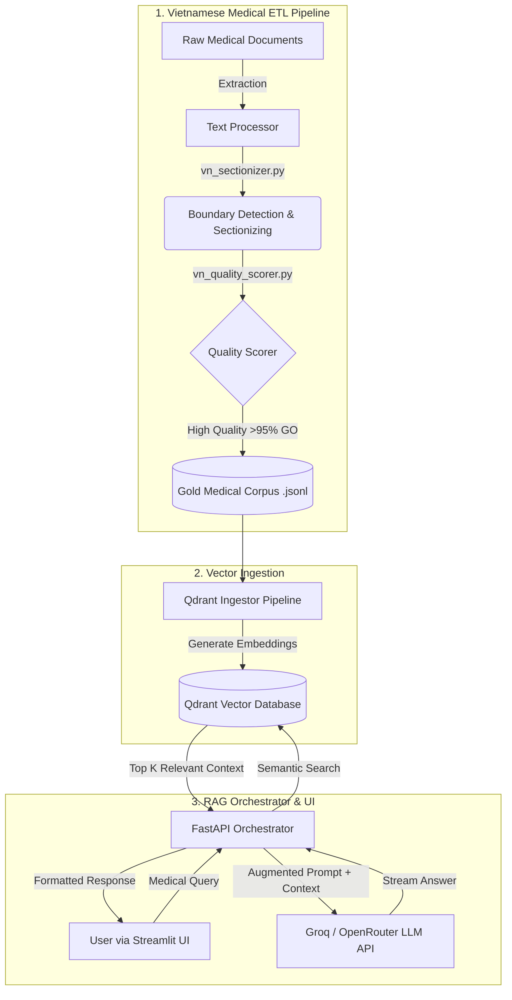

# Cloud-Native-Medical-RAG-Platform

## Introduction
The **Cloud-Native-Medical-RAG-Platform** is a scalable, cloud-native Question Answering system tailored specifically for the **Vietnamese Medical Knowledge Domain**. Built upon a robust Retrieval-Augmented Generation (RAG) architecture, this platform bridges the gap between raw, unstructured Vietnamese medical guidelines and an interactive, real-time AI assistant for healthcare professionals, researchers, and students.

## Project Goals
1. **Vietnamese Medical Gold Corpus**: Automate the extraction, sectionizing, and quality scoring of Vietnamese medical documents (from WHO Vietnam, Ministry of Health `kcb_moh`, OJS Journals, etc.) to combat data scarcity and hallucination in medical LLMs.
2. **High-Fidelity Retrieval**: Ensure accurate semantic search across specialized medical terminology using Qdrant Vector DB and custom chunking/boundary detection tailored for the Vietnamese language.
3. **Cloud-Native & Scalable**: Provide an end-to-end deployable infrastructure using Kubernetes, Helm, and Terraform with full observability (Prometheus, Grafana, ELK).
4. **Fast & Reliable Inference**: Utilize cutting-edge external LLM platforms (Groq, OpenRouter) for safe, hallucination-free medical advice at extremely low latency.

## System Architecture & Activity Flow

The operational flow of the project is grouped into three main stages: Data Processing (ETL), Vector Ingestion, and the RAG Serving layer.



### 1. Data Processing Pipeline (Vietnamese Medical Corpus)
Our ETL pipeline handles complex Vietnamese documents with high precision:
- **`vn_sectionizer.py`**: Intelligently splits massive medical textbooks and journals into discrete, focused articles by detecting chapter boundaries and procedural anchors using heuristic logic.
- **`vn_quality_scorer.py`**: Automatically evaluates chunks to filter out reference leaks (`ref_leak`), messy OCR, and irrelevant metadata. Only articles meeting the strict `GO` threshold are passed to the database.

### 2. Semantic Ingestion Pipeline
- Safely processes the multi-source "Gold Corpus" (e.g., `kcb_moh`, `who_vietnam`, `vmj_ojs`).
- Utilizes an offline or remote GPU embedding API to generate vector spaces and upserts them into a **Qdrant Vector Database** isolated in the Kubernetes `model-serving` namespace.

### 3. RAG Serving & Evaluation
- **FastAPI RAG Orchestrator**: Manages chat history in Redis, dynamically formulates the RAG context, and streams it alongside NeMo Guardrails constraints.
- **Evaluation Toolkit**: Includes `fast_eval.py` to benchmark the retrieval and generation capabilities against human-annotated testing sets (`eval_queries.json`).

## Technology Stack
- **Backend & Data**: Python, FastAPI, Qdrant, Redis
- **Frontend**: Streamlit
- **Infrastructure**: Docker, Kubernetes (standard GKE), Terraform, Helm CI/CD (Jenkins)
- **Observability**: Prometheus, Grafana, ELK Stack, OpenTelemetry (Jaeger)

## Local Setup & Deployment Guide

### Local Development (Docker Compose)
1. Provide your LLM API Key (Groq or OpenRouter) in `docker-compose.local.yml`.
2. Start the local stack:
   ```bash
   docker-compose -f docker-compose.local.yml up -d --build
   ```
3. Access the Streamlit UI at `http://localhost:8501`.

### Cloud-Native Kubernetes Deployment
1. **Provision Infrastructure**: Navigate to `terraform/` and run `terraform apply` to provision a Google Kubernetes Engine (GKE) cluster.
2. **Container Registry**: Build the Docker container images for `rag-orchestrator`, `qdrant-ingestor`, and `streamlit-ui`, then push them to a private or public Docker registry (e.g., GCP Artifact Registry).
3. **Helm Deploy**: Use the aggregated Helm charts in `charts/model-serving` to launch the platform into your cluster:
   ```bash
   helm install model-serving charts/model-serving -n model-serving --create-namespace -f charts/model-serving/values-dev.yaml
   ```

## Citation
If you use this Cloud-Native-Medical-RAG-Platform or our comprehensive Vietnamese Medical Corpus in your research, please cite:
```bibtex
@software{CloudNativeMedRAG2026,
  author  = {jprosun},
  title   = {Cloud-Native-Medical-RAG-Platform: Scalable VN Medical Pipeline & QA System},
  year    = {2026},
  url     = {https://github.com/jprosun/Cloud-Native-Medical-RAG-Platform},
  note    = {Optimization of Vietnamese medical RAG corpora, Kubernetes-native deployment.}
}
```