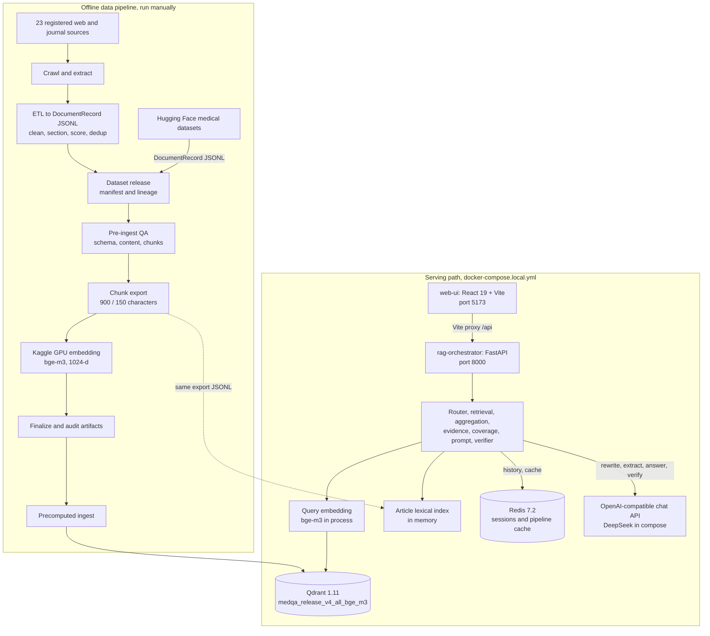
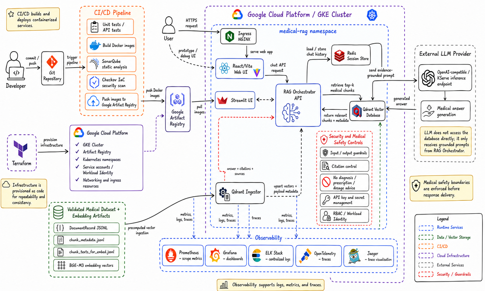

# Medical RAG Platform

Retrieval-augmented question answering over Vietnamese medical literature: an offline corpus pipeline, a FastAPI orchestrator with a React chat UI, and a reference Kubernetes deployment.

English | [Tiếng Việt](README.vi.md)


> [!WARNING]
> **Medical disclaimer.** This is a research and engineering project. It is not a medical device and not a substitute for a qualified clinician. Do not use its output for diagnosis, prescribing or dosing decisions.

## Status of this repository

`main` holds a snapshot of the system as of June 2026. Later work is not yet merged into this repository: claim-level span and citability gates, an abstention contract, removal of development-tuned heuristics (decontamination), and the attribution audit described under [Evaluation](#evaluation). The evaluation artifact for that later version is public at [jprosun/vi-medrag-audit](https://github.com/jprosun/vi-medrag-audit).

## Overview

The project covers the path from raw web pages to a cited answer in a chat window.

**Offline data pipeline** (Python scripts, run manually)

- Crawl and extract for 23 registered Vietnamese and international sources (`pipelines/crawl/source_registry.py`), including the Vietnam Medical Journal, WHO, MedlinePlus, NCBI Bookshelf and several Vietnamese government and journal sites, plus exports of three Hugging Face medical datasets (`tools/hf_export_medical_records.py`).
- Source-specific ETL to a common `DocumentRecord` JSONL schema, with Vietnamese text cleaning, sectioning, title extraction, quality scoring and deduplication (`pipelines/etl/`, `pipelines/etl/vn/`).
- A three-layer pre-ingest QA gate (schema, content, chunks) and versioned dataset releases with manifests and lineage fields (`services/qdrant-ingestor/qa_pre_ingest/`, `tools/build_dataset_release.py`).
- Structure-aware chunking (heading sections, 900-character windows with 150 overlap), `BAAI/bge-m3` 1024-d embeddings computed offline on a Kaggle GPU, an alignment audit of the artifacts, and a precomputed-vector loader for Qdrant (`tools/kaggle/`, `services/qdrant-ingestor/ingest_kaggle_precomputed.py`).

**Serving** (`services/rag-orchestrator`, `services/web-ui`)

- FastAPI orchestrator with a rule-based query router, optional LLM query rewriting for follow-up questions, and session topic memory.
- Retrieval that merges dense Qdrant search with an in-memory article-level lexical index, ranked by a heuristic additive score. This is not BM25 or reciprocal rank fusion, and there is no cross-encoder reranker.
- Article aggregation, evidence extraction (regex, or an LLM extractor for some question types), conflict tagging, coverage scoring and prompt assembly.
- Generation through any OpenAI-compatible chat-completions endpoint (DeepSeek in the compose file), followed by an answer verifier that can pass, revise or block the answer.
- Server-Sent Events streaming, Redis-backed sessions and pipeline cache, and a Prometheus `/metrics` endpoint.
- A React 19 + Vite chat UI with conversation history and a source panel.

**Reference deployment**: Helm charts, Terraform for a GKE cluster and a Jenkins pipeline (see [Kubernetes reference deployment](#kubernetes-reference-deployment)).

## Architecture


```mermaid
flowchart TB
  subgraph OFF["Offline data pipeline, run manually"]
    SRC["23 registered web and journal sources"]
    HF["Hugging Face medical datasets"]
    CRAWL["Crawl and extract"]
    ETL["ETL to DocumentRecord JSONL<br/>clean, section, score, dedup"]
    REL["Dataset release<br/>manifest and lineage"]
    QA["Pre-ingest QA<br/>schema, content, chunks"]
    EXP["Chunk export<br/>900 / 150 characters"]
    EMB["Kaggle GPU embedding<br/>bge-m3, 1024-d"]
    FIN["Finalize and audit artifacts"]
    ING["Precomputed ingest"]
  end

  subgraph SERVE["Serving path, docker-compose.local.yml"]
    UI["web-ui: React 19 + Vite<br/>port 5173"]
    API["rag-orchestrator: FastAPI<br/>port 8000"]
    PIPE["Router, retrieval, aggregation,<br/>evidence, coverage, prompt, verifier"]
    EMBQ["Query embedding<br/>bge-m3 in process"]
    LEX["Article lexical index<br/>in memory"]
    QD[("Qdrant 1.11<br/>medqa_release_v4_all_bge_m3")]
    RD[("Redis 7.2<br/>sessions and pipeline cache")]
    LLM["OpenAI-compatible chat API<br/>DeepSeek in compose"]
  end

  SRC --> CRAWL --> ETL --> REL
  HF -->|"DocumentRecord JSONL"| REL
  REL --> QA --> EXP --> EMB --> FIN --> ING --> QD
  EXP -.->|"same export JSONL"| LEX

  UI -->|"Vite proxy /api"| API
  API --> PIPE
  PIPE --> EMBQ --> QD
  PIPE --> LEX
  PIPE -->|"history, cache"| RD
  PIPE -->|"rewrite, extract, answer, verify"| LLM
```

### Request flow

1. The UI POSTs `{session_id, message, answer_mode}` to `/api/chat/stream`; the Vite dev server proxies `/api` to the orchestrator. If the stream cannot be opened, the UI falls back to `/api/chat`.
2. Both endpoints run the same generator (`_chat_core` in `app/main.py`). Session history is loaded from Redis (in memory if `REDIS_URL` is unset) and the user message is appended.
3. **Rewrite.** If there is history and the message looks like a follow-up, it is rewritten into a standalone question (LLM call when `LLM_REWRITER_ENABLED`, otherwise a rule).
4. **Route.** A rule-based router assigns a question type, retrieval profile (light/standard/deep), retrieval mode and answer policy. `answer_mode=thinking` deepens retrieval and length.
5. **Retrieve.** The query is expanded, embedded in process with `BAAI/bge-m3`, and searched in Qdrant with optional payload filters. Dense hits are re-sorted by cosine plus hand-set query, content and source bonuses, then cut at `RAG_MIN_SCORE` on raw cosine. When hybrid mode is on, the lexical article index adds chunks with a synthetic score (0.62 plus a token, phrase and title match score) that skip the cosine threshold, and the merged pool is re-sorted by score plus bonuses. Explainer questions in thinking mode are split heuristically into up to three subqueries that are retrieved separately. An entity-focused second retrieval runs when the query entities are poorly covered.
6. **Filter.** Bibliography-like and low-quality chunks are dropped or down-weighted.
7. **Aggregate.** Chunks are grouped by article; a primary article and a few secondary ones are chosen, and the primary article may be expanded with more of its chunks.
8. **Evidence.** Findings, numbers and spans are extracted, normalized and checked for simple polarity conflicts between sources.
9. **Coverage.** A heuristic scorer labels how well the evidence covers the question (`evidence_strong`, `title_anchored`, `open_knowledge` or `retrieval_failed`).
10. **Prompt.** The prompt is built under one of two policies: `strict_rag` (grounding rules) or `open_enriched`, which allows uncited background knowledge and is selected for most question types.
11. **Generate.** The LLM response is streamed as `token` events. If the call fails (for example an HTTP 401 from a missing or invalid key, a timeout, a rate limit or an empty stream) or the LLM client is disabled, the answer is a deterministic fallback flagged with `degraded_mode`, and it is not verified (see [Known limitations](#known-limitations)).
12. **Verify.** Unless generation fell back to a degraded answer or `LLM_VERIFIER_ENABLED=false`, deterministic checks run: citation numbers within the number of sources; numeric, dose or guideline wording in an answer that has no citation at all; `open_enriched` answers under 180 words. These only record issues in the metadata. An LLM verifier pass, given the answer and the evidence text, runs in thinking mode and in some other cases (numeric requirements, external sources, retrieval failure, dose or guideline wording). Only its verdict can revise the answer or replace it with a fixed refusal.
13. **Persist.** The answer, retrieved chunks and metadata (timings, cache hits, pipeline flags) are stored in the session and returned in the `final` event.

> [!NOTE]
> In streaming mode, tokens reach the client before verification runs. The `final` event carries the verified answer, which may be revised or replaced, and the UI swaps the streamed text for it. Only `/api/chat` returns verified text alone.

## Evaluation

The audit reported in *Retrievable, Citable, Rarely Responsive: Auditing Attribution Coverage in a Vietnamese Medical RAG System* (Nguyen Duc Son, a RIVF 2026 submission) measured a later, decontaminated version of this system, not the code on this branch. In short: retrieval returns topically relevant passages, and the claims the system returns are almost always supported by the passage they cite (largely because they are copied from it verbatim), but very few returned claims answer the question, and a large share of the index cannot carry a citation a reader can follow.

All figures below come from the public artifact [jprosun/vi-medrag-audit](https://github.com/jprosun/vi-medrag-audit) (134 frozen questions: 119 answerable and 15 out-of-corpus controls). "Shipped" is the later version's default design: after generation, its span and citability gates (not present on this branch) withhold claims that lack a located span or a source URL. "URL-first" excludes the URL-less stratum at retrieval and keeps the span check. Each design was run once.

| Measure | Value | Denominator or interval | What it means |
|---|---|---|---|
| Indexed chunks | 595,663 | census of the live collection on 2026-09-04, after a later deduplication of the journal stratum | Size of the audited index; a collection built from this snapshot will differ |
| Chunks with no source URL | 43.05% | 256,415 of 595,663, all from one Hugging Face dataset | These chunks cannot carry a citation link |
| Chunks with only an issue-level URL | 13.4% | 79,678 chunks share 143 URLs, all probed | For 142 of the 143 URLs the link opens a journal issue index, which does not identify the cited article |
| Retrieved chunks from the URL-less stratum | 61.4% | 2,472 of 4,024 chunks retrieved in the shipped-design run over the 134 questions | Retrieval over-represents the uncitable stratum relative to its 43.05% share of the index |
| Claims returned, shipped design | 0.527 | 185 of 351 extracted (19 withheld by the span gate, 147 for citability); 79 of 134 answers end with no returned claim | Cost of the span and citability gates applied after generation |
| Claims returned, URL-first design | 0.960 | 364 of 379 extracted (15 withheld by the span gate); 25 of 134 answers with no returned claim | High by construction, since no URL-less record can be cited; it also returns more claims on the 15 out-of-corpus controls (41 vs 25) |
| Supported by the cited passage, shipped vs URL-first | 0.968 vs 0.956 | 179/185 vs 348/364; difference 0.012, 95% CI [-0.016, 0.039] | Near-automatic: 183 of 185 shipped claims are verbatim passage sentences, so this bounds the design rather than showing answer quality |
| Responsive to the question, shipped vs URL-first | 0.038 vs 0.036 | 7/185 vs 13/364; difference 0.002, 95% CI [-0.020, 0.027] | Very few returned claims answer the question |
| Answers with at least one responsive claim | about 9% | 5 of 55 vs 10 of 109 answers that return any claim (5/134 and 10/134 overall) | Answer-level responsiveness is low in both designs |

Support and responsiveness use the artifact's matched protocol (same codebook, judge model, adjudicator prompt and batch size for both arms), which holds the judging instrument fixed across the two designs. Under the original single-arm judging the shipped responsiveness is 4/185 = 0.022; the paper gives responsiveness as 0.02 to 0.04 depending on the judge. Difference intervals come from 5,000 paired-question bootstrap resamples (seed 20260907), conditional on the one captured generation per design, so they do not include run-to-run variability. No equivalence margin was pre-specified, so they do not show that the designs are equivalent.

**Reproduce the checks**

```bash
git clone https://github.com/jprosun/vi-medrag-audit.git && cd vi-medrag-audit && python evaluate.py
```

This needs Python 3.10+ and the standard library only, with no API keys or model calls. It verifies file hashes and runs the public checks. Verification that depends on the source text is excluded, because the retrieved passages are withheld from the artifact. Claim retention, support, responsiveness and answer-level figures are recomputed from the released labels and captures. The index census figures (first three rows) are read from a recorded census of the live collection and only checked for consistency with the paper, because regenerating them requires the original Qdrant collection.

**Scope limits**

- One corpus, one generator, one embedding model, one language, and one run per design.
- Support and responsiveness are model-judged. Blind calibration was done by the author only (110 judgments over 101 claims); no clinician or independent rater was involved.
- Generator and verifier model IDs were not recorded in the captures.
- This is not a clinical evaluation of the answers.

### Development benchmarks in this snapshot

`benchmark/` contains the evaluation runners (`benchmark/runners/`), the synthetic gold-set pipeline (`benchmark/synthetic_gold_pipeline/`) and a 24-question topic set (`benchmark/datasets/medqa_topic_gold_v2.jsonl`). The summary files in `benchmark/datasets/test_results/` are development logs, not results. The retrieval and evidence-selection code in this snapshot contains heuristics tuned on the development questions, for example question-specific score boosts and an evidence fallback that appends claims matching expected answers, so numbers produced with it are not a fair measure of the system.

In the later version measured by the audit, the question-specific boosts, the claim-appending fallback and a hand-written fallback answer were removed, the remaining query-alias hints were put behind an off-by-default flag, and a lint test (`services/rag-orchestrator/tests/test_no_scoring_contamination.py` in the unmerged later version) guards against reintroducing per-question medical terms. Generic hand-set ranking coefficients remain in that version.

## Quick start with Docker Compose

**Prerequisites**

- Docker with Compose v2.
- An API key for an OpenAI-compatible chat-completions endpoint. The compose file is set up for DeepSeek and reads `DEEPSEEK_API_KEY` from `.env`. A missing or invalid key does not produce an error: answers fall back to the unverified degraded answer described in [request flow](#request-flow) step 11.
- Python 3.11 on the host with `numpy` (for the artifact audit) and, optionally, `qdrant-client` (for the payload-index script).
- A corpus and its vectors. **The data is not distributed with this repository.** `rag-data/` is gitignored, so you must build a collection with the [data pipeline](#data-pipeline) or supply your own artifacts in the same layout.

**1. Clone and configure**

```bash
git clone https://github.com/jprosun/Medical-RAG-Platform.git
cd Medical-RAG-Platform
printf 'DEEPSEEK_API_KEY=your_key_here\n' > .env   # .env is gitignored
```

`TAVILY_API_KEY` (also read from `.env`) is only used if you set `EXTERNAL_SEARCH_ENABLED: "true"` in `docker-compose.local.yml`; that flag is hard-coded there and is not read from `.env`.

**2. Place the precomputed artifacts**

The compose file expects dataset `medqa_release_v4_all_bge_m3`, profile `multilingual`:

```text
rag-data/embeddings/
├── exports/medqa_release_v4_all_bge_m3/multilingual/
│   ├── chunk_metadata.jsonl
│   ├── chunk_texts_for_embed.jsonl
│   └── kaggle_embedding_input.jsonl      # also loaded as the lexical index
└── staging/medqa_release_v4_all_bge_m3/multilingual/
    ├── embeddings.npy                    # 1024-d bge-m3 vectors
    └── chunk_ids.json
```

Check that IDs, texts, metadata and vectors are aligned before ingesting; ingest only if the audit reports `pass`:

```bash
python tools/audit_embedding_artifacts.py --dataset-id medqa_release_v4_all_bge_m3 --profile multilingual
```

**3. Start the stores and load the vectors**

```bash
docker compose -f docker-compose.local.yml up -d qdrant redis
docker compose -f docker-compose.local.yml --profile precomputed-ingest run --rm --build qdrant-precomputed-ingestor
```

To delete and rebuild the collection, pass the flag before the service name (placed after it, it is ignored):

```bash
docker compose -f docker-compose.local.yml --profile precomputed-ingest run --rm --build \
  -e QDRANT_RECREATE_COLLECTION=true qdrant-precomputed-ingestor
```

Optionally create payload indexes with `python tools/create_qdrant_payload_indexes.py --collection medqa_release_v4_all_bge_m3`.

**4. Start the API and the UI**

```bash
docker compose -f docker-compose.local.yml --profile docker-ui up -d --build
```

| URL | What |
|---|---|
| http://localhost:5173 | React chat UI (Vite dev server) |
| http://localhost:8000 | Orchestrator API |
| http://localhost:8000/docs | OpenAPI (Swagger) docs |
| http://localhost:8000/metrics | Prometheus metrics |

The first start downloads `BAAI/bge-m3` into the `hf_model_cache` volume, so the orchestrator can take a few minutes to become healthy. The lexical article index is not loaded at startup: the first question reads the whole `kaggle_embedding_input.jsonl` into memory, so it is slow, and the orchestrator container needs enough RAM to hold that file's contents. Without `--profile docker-ui`, only Qdrant, Redis and the orchestrator start. Logs: `docker compose -f docker-compose.local.yml logs -f rag-orchestrator web-ui`. Stop with `down` (keeps the Qdrant volume) or `down -v` (deletes volumes).

`docker-compose.fast.yml` is an override file (`-f docker-compose.local.yml -f docker-compose.fast.yml`). Its only effective change against the code defaults is enabling the retrieval cache (`RETRIEVAL_CACHE_ENABLED=true`); the other variables it sets are already on by default.

## Configuration

Selected orchestrator variables. The compose value is what `docker-compose.local.yml` sets; the code default applies when a variable is unset.

| Variable | Compose value | Code default | Purpose |
|---|---|---|---|
| `QDRANT_URL` | `http://qdrant:6333` | empty (retrieval disabled) | Qdrant endpoint |
| `QDRANT_COLLECTION` | `medqa_release_v4_all_bge_m3` | `medical_docs` | Collection name |
| `EMBEDDING_MODEL` | `BAAI/bge-m3` | `BAAI/bge-small-en-v1.5` | Query embedder; must match the collection's vectors |
| `RAG_ENABLE_HYBRID` | `true` | `false` | Enable the lexical article index |
| `RAG_ARTICLE_INDEX_PATH` | the export's `kaggle_embedding_input.jsonl` | empty | JSONL used for the lexical index |
| `RAG_TOP_K` | `14` | `4` | Fallback top-k; the router's profile value normally overrides it |
| `RAG_MIN_SCORE` | `0.45` | `0.25` | Cosine threshold for dense hits |
| `RAG_MAX_CONTEXT_TOKENS` | `6000` | `2048` | Context budget |
| `REDIS_URL` | `redis://redis:6379/0` | unset (in-memory sessions) | Sessions and pipeline cache |
| `KSERVE_ENABLED` | `true` | `false` | Must be `true` to build an LLM client |
| `KSERVE_BASE_URL` / `KSERVE_COMPLETIONS_PATH` | `https://api.deepseek.com` / `/chat/completions` | empty / `/v1/completions` | Chat-completions endpoint (the `KSERVE_` prefix is historical) |
| `LLM_MODEL_ID` / `LLM_API_KEY` | `deepseek-v4-flash` / `${DEEPSEEK_API_KEY}` | required / none | Model and bearer token |
| `LLM_TIMEOUT_S` | `60` | `300` | Request timeout in seconds |
| `LLM_REWRITER_ENABLED` / `LLM_EXTRACTOR_ENABLED` | `true` / `true` | `true` / `false` | Optional LLM side calls |
| `LLM_VERIFIER_ENABLED` | `true` | `true` | `false` turns off the whole verification stage, deterministic checks included |
| `EXTERNAL_SEARCH_ENABLED` | `false` | `false` | Tavily search restricted to a domain allowlist |
| `GUARDRAILS_ENABLED` | unset | `false` | NeMo Guardrails path instead of the chat API (see [Kubernetes notes](#kubernetes-reference-deployment)) |

The path in `RAG_ARTICLE_INDEX_PATH` is `/rag-data/embeddings/exports/medqa_release_v4_all_bge_m3/multilingual/kaggle_embedding_input.jsonl`. The Kubernetes values files use an older retrieval configuration (`bge-small-en-v1.5`, 384-d, collection `medical_docs`); do not point them at the 1024-d collection without changing the embedding model.

## API

| Method | Path | Purpose |
|---|---|---|
| POST | `/api/chat` | Answer a message; returns the full `ChatResponse` |
| POST | `/api/chat/stream` | Same pipeline as Server-Sent Events |
| GET | `/api/sessions` | List sessions, newest first |
| GET | `/api/session/{session_id}` | Messages of one session |
| PUT | `/api/session/{session_id}/title` | Rename a session |
| DELETE | `/api/session/{session_id}` | Delete a session |
| GET | `/health`, `/live` | Liveness |
| GET | `/ready` | Readiness (see [Known limitations](#known-limitations)) |
| GET | `/metrics` | Prometheus exposition |

Request body for both chat endpoints:

```json
{ "message": "Tăng huyết áp là gì?", "answer_mode": "standard" }
```

`session_id` is optional: omit it to start a new session, or pass the value from a previous response to continue a conversation. `answer_mode` is `standard` (default) or `thinking`; a few aliases are also recognized and unknown values fall back to `standard`. The response contains `session_id`, `answer`, `history`, `context_used`, `retrieved_chunks`, `metadata`, `external_sources`, `degraded_mode` and `degraded_reason`.

The stream emits one `data: {"type": ...}` line per event: `stage` (progress label), `token` (`delta` text), `final` (the same payload as `/api/chat`) and `error` (`detail`).

```bash
curl -N -X POST http://localhost:8000/api/chat/stream \
  -H "Content-Type: application/json" \
  -d '{"message": "Tăng huyết áp là gì?", "answer_mode": "standard"}'
```

## Data pipeline

All data lives under `rag-data/` (create the layout with `python tools/scaffold_rag_data_layout.py`). The full walkthrough, naming contract and directory layout are in [docs/data/workflow.md](docs/data/workflow.md); run its PDF-extraction step as `python -m tools.extract_digital_pdf` (it reads `rag-data/corpus_catalog.csv`), because the script form shown there fails with `ModuleNotFoundError`.

The examples use the dataset ID `all_corpus_v1`. To use the compose file unchanged, use `--dataset-id medqa_release_v4_all_bge_m3` instead; otherwise change `QDRANT_COLLECTION`, `RAG_ARTICLE_INDEX_PATH` and `EMBED_DATASET_ID` in `docker-compose.local.yml` (or pass `-e EMBED_DATASET_ID=... -e QDRANT_COLLECTION=...` to the ingestor run). The main steps, in order:

```bash
# 1. Crawl raw data into rag-data/sources/<source_id>/raw/
python -m pipelines.crawl.run_source --source-id vmj_ojs      # any of the 23 registered IDs
python -m pipelines.etl.medlineplus_scraper                    # standalone English scrapers
python -m pipelines.etl.who_scraper
python -m pipelines.etl.ncbi_bookshelf_scraper
python tools/hf_export_medical_records.py --dataset mtue29     # or medquad, ynguyen1010

# 2. Extract, ETL and promote sources to DocumentRecord JSONL
#    group1 = 5 ETL-ready sources; repeat for group2 (add --reconcile), group3 and group4,
#    or use --group all_extract_planned (see pipelines/etl/source_groups.py)
python -m pipelines.etl.run_extract_etl_plan --group group1 --extract --etl --promote
python -m pipelines.etl.vn.vmj_issue_splitter
python -m pipelines.etl.vn.vn_txt_to_jsonl --source-id vmj_ojs

# 3. Build a dataset release (records, manifest, QA summary)
#    --source-group all covers only the 23 crawl sources; add each exported HF source
#    (hf_medquad, hf_vi_mtue29_medical, hf_vi_ynguyen_medical) with --source-id
python tools/build_dataset_release.py --dataset-id all_corpus_v1 --source-group all \
  --source-id hf_vi_mtue29_medical

# 4. Pre-ingest QA (schema, content, chunks); exits non-zero on a NO-GO verdict
(cd services/qdrant-ingestor && python -m qa_pre_ingest.run_all_checks \
  ../../rag-data/datasets/all_corpus_v1/records/document_records.jsonl)

# 5. Export chunks for offline embedding (900/150 characters by default)
python tools/kaggle/export_chunks_for_kaggleV2.py --dataset-id all_corpus_v1 --profile multilingual

# 6. Embed on a GPU with tools/kaggle/offline_gpu_embedding_multilingual.py or the notebook,
#    then copy the output into staging and audit it
python tools/kaggle/finalize_kaggle_embedding_artifacts.py --input-dir <kaggle_output_dir> \
  --dataset-id all_corpus_v1 --profile multilingual
python tools/audit_embedding_artifacts.py --dataset-id all_corpus_v1 --profile multilingual

# 7. Ingest: set EMBED_DATASET_ID, KAGGLE_PROFILE and QDRANT_COLLECTION to the same release
#    and run services/qdrant-ingestor/ingest_kaggle_precomputed.py (or the compose service)
```

Some sources read seed URLs from `rag-data/corpus_catalog.csv`, which is not in the repository. Records carry lineage fields (`raw_path`, `processed_path`, `source_sha256`, `crawl_run_id`, `etl_run_id` and others) that are forwarded to the Qdrant payload. The pipeline and tool dependencies (`requests`, `beautifulsoup4`, `pymupdf` and others) are not captured in a requirements file; only the services have `requirements.txt` files.

## Tests

```bash
# rag-orchestrator: 134 unit tests
pip install -r services/rag-orchestrator/requirements.txt
(cd services/rag-orchestrator && python -m pytest -q)

# qdrant-ingestor, pipelines and tools: 167 tests, run from the repository root.
# The suite also imports pipeline and tool modules whose dependencies are not in any
# requirements file.
pip install -r services/qdrant-ingestor/requirements.txt pytest numpy pymupdf requests beautifulsoup4
python -m pytest services/qdrant-ingestor/tests
```

The first orchestrator run downloads a small fastembed model. In the second suite, two release-tooling tests (`test_build_dataset_release.py`, `test_promote_etl_sources_to_data_proceed.py`) currently fail on Windows.

## Kubernetes reference deployment

These files date from the project's initial version and have not been kept in sync with the compose stack. They have not been verified end to end.

| Part | What it contains | Status |
|---|---|---|
| `terraform/` | GKE Standard cluster and one autoscaling node pool on an existing VPC and subnet | Two resources only; no registry, IAM or remote state |
| `charts/model-serving` | Umbrella chart: orchestrator, Streamlit UI, Redis, Qdrant, plus init and ingestion jobs | Earlier retrieval configuration (`bge-small-en-v1.5`, 384-d, `medical_docs`); in-pod `emptyDir` storage; see notes below |
| `charts/monitoring`, `logging`, `tracing` | Prometheus scraping `/metrics`, Grafana; Elasticsearch, Logstash, Kibana, Filebeat; OpenTelemetry collector and Jaeger | Grafana has no provisioned dashboards; Filebeat ships directly to Elasticsearch |
| `charts/ingress-nginx` | Vendored upstream ingress-nginx chart 4.14.3 | Unmodified as far as checked |
| `Jenkinsfile`, `ci/` | Unit tests, SonarQube, Checkov, build and push of 3 images, `helm uninstall` then `helm upgrade --install` | No record of a run in the repository |

- The orchestrator chart sets `REDIS_HOST` but not `REDIS_URL`, so sessions stay in memory per pod.
- It sets `GUARDRAILS_ENABLED=true`. That path replaces the chat API call with NeMo Guardrails, whose input and output rails are empty; the only flow is one sample Colang dialogue with a canned reply, and no tokens are streamed.



*Target cloud design, drawn for an earlier README (July 2026). The services, CI stages and observability charts it shows exist as code, but several parts are not implemented as drawn: there is no KServe deployment, the guardrail input and output rails are empty, the charts deploy the Streamlit UI rather than the React UI, and Terraform creates only the cluster and node pool.*

## Known limitations

- The corpus, vectors and gold sets used during development are not distributed, so the quick start cannot run without building or supplying a collection.
- Hybrid retrieval is a heuristic additive score over dense and lexical candidates, with no BM25, rank fusion or neural reranker; the lexical index is a linear scan held in memory.
- Streamed tokens are shown before verification. The deterministic checks only test that citation numbers do not exceed the number of retrieved sources and flag an answer that has numeric, dose or guideline wording but no citation at all. The conditional LLM pass is asked to flag cited claims the evidence does not support, but nothing checks deterministically that a cited passage contains the claim. The `open_enriched` policy permits uncited background knowledge.
- This snapshot contains question-specific heuristics tuned on development questions (see [Development benchmarks](#development-benchmarks-in-this-snapshot)). Under the `open_enriched` policy, its degraded fallback answer also begins with fixed, hand-written Vietnamese paragraphs on biopsy and immunohistochemistry, whatever the question, followed by up to five extracted evidence sentences. The later version removed both.
- The Helm configuration lags the compose stack (embedding model, collection, UI, storage, Redis wiring).
- `pipelines/`, `tools/` and `benchmark/` have no dependency manifest. The compose `ingest` profile embeds with fastembed, which may not support `BAAI/bge-m3`; the precomputed path is the one used.
- The web-ui container runs the Vite dev server, not a production build. `/ready` only probes dependencies named by `REDIS_HOST`, `QDRANT_HOST` or `KSERVE_HOST`, none of which compose sets, and always returns HTTP 200.

## Repository layout

```text
.
├── benchmark/
│   ├── datasets/                  # 24-question topic set; test_results/ holds development logs
│   ├── runners/                   # evaluation runners and scorers (client of /api/chat)
│   └── synthetic_gold_pipeline/   # scripts that built the synthetic gold set
├── charts/                        # Helm: model-serving, rag-orchestrator, streamlit, redis, qdrant,
│                                  #   monitoring, logging, tracing, vendored ingress-nginx
├── ci/                            # Jenkins controller image and setup notes
├── docs/
│   ├── architecture/retrieval-deep-dive.md   # retrieval walkthrough (Vietnamese)
│   ├── assets/medqa-system-architecture.png
│   ├── data/workflow.md                      # rag-data layout and data workflow
│   └── plans/hf-dataset-ingest-plan.md
├── pipelines/
│   ├── crawl/                     # source registry, crawlers, extractors
│   └── etl/                       # source ETL; vn/ holds the Vietnamese text pipeline
├── scripts/sprint2/               # one-off audit scripts from an earlier sprint
├── services/
│   ├── rag-orchestrator/          # FastAPI app (app/), tests/, guardrails/
│   ├── web-ui/                    # React + Vite chat UI
│   ├── streamlit-ui/              # Streamlit UI used by the Helm deployment
│   ├── qdrant-ingestor/           # chunking, ingest, pre-ingest QA, tests for pipelines and tools
│   └── utils/                     # shared paths, logging, tracing, lineage helpers
├── terraform/                     # GKE cluster and node pool
├── tools/                         # releases, HF export, audits, Qdrant utilities
│   └── kaggle/                    # chunk export, GPU embedding, finalize and import
├── docker-compose.local.yml       # local stack
├── docker-compose.fast.yml        # override that enables the retrieval cache
├── Dockerfile.qdrant, Dockerfile.redis
├── ingress-nginx-observe-values.yaml
└── Jenkinsfile
```

## Further documentation

- [docs/data/workflow.md](docs/data/workflow.md): data layout, naming contract and pipeline commands.
- [docs/architecture/retrieval-deep-dive.md](docs/architecture/retrieval-deep-dive.md): step-by-step retrieval walkthrough (Vietnamese).
- [charts/README.md](charts/README.md): Helm chart design notes; some statements, such as PVC-backed storage, do not match the templates.
- [ci/README.md](ci/README.md): Jenkins setup notes.
- Evaluation: [jprosun/vi-medrag-audit](https://github.com/jprosun/vi-medrag-audit). To cite the paper or the artifact, use its [CITATION.cff](https://github.com/jprosun/vi-medrag-audit/blob/HEAD/CITATION.cff).
