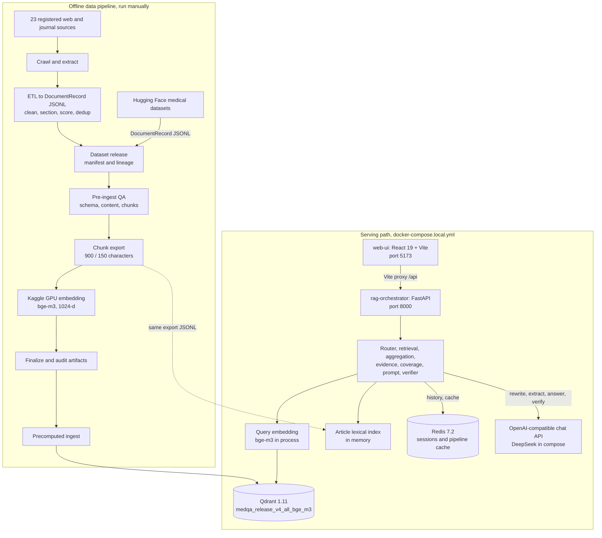

# Medical RAG Platform

Hệ thống hỏi đáp tăng cường truy xuất (retrieval-augmented) trên tài liệu y khoa tiếng Việt: một pipeline xử lý corpus offline, một orchestrator FastAPI kèm giao diện chat React, và một bản triển khai Kubernetes tham chiếu.

[English](README.md) | Tiếng Việt


> [!WARNING]
> **Tuyên bố miễn trừ trách nhiệm y khoa.** Đây là một dự án nghiên cứu và kỹ thuật. Nó không phải là thiết bị y tế và không thay thế cho bác sĩ có chuyên môn. Không dùng kết quả của nó để chẩn đoán, kê đơn hay quyết định liều dùng.

## Trạng thái của repository

`main` chứa snapshot của hệ thống tại thời điểm tháng 6 năm 2026. Các phần việc sau đó chưa được merge vào repository này: các gate kiểm tra span và khả năng trích dẫn (citability) ở mức claim, một abstention contract (quy ước từ chối trả lời), việc loại bỏ các heuristic được tinh chỉnh trong quá trình phát triển (decontamination), và attribution audit được mô tả ở mục [Đánh giá](#đánh-giá). Artifact đánh giá của phiên bản sau đó được công khai tại [jprosun/vi-medrag-audit](https://github.com/jprosun/vi-medrag-audit).

## Tổng quan

Dự án bao quát toàn bộ đường đi từ trang web thô đến một câu trả lời có trích dẫn trong cửa sổ chat.

**Pipeline dữ liệu offline** (các script Python, chạy thủ công)

- Crawl và trích xuất cho 23 nguồn tiếng Việt và quốc tế đã đăng ký (`pipelines/crawl/source_registry.py`), gồm Tạp chí Y học Việt Nam (Vietnam Medical Journal), WHO, MedlinePlus, NCBI Bookshelf và một số trang của cơ quan nhà nước và tạp chí Việt Nam, cùng với bản export của ba bộ dữ liệu y khoa trên Hugging Face (`tools/hf_export_medical_records.py`).
- ETL riêng theo từng nguồn về một schema JSONL chung `DocumentRecord`, với làm sạch văn bản tiếng Việt, chia section, trích xuất tiêu đề, chấm điểm chất lượng và khử trùng lặp (`pipelines/etl/`, `pipelines/etl/vn/`).
- Một QA gate trước ingest gồm ba lớp (schema, nội dung, chunk) và các bản release dataset có version, kèm manifest và các trường lineage (`services/qdrant-ingestor/qa_pre_ingest/`, `tools/build_dataset_release.py`).
- Chunking theo cấu trúc (section theo heading, cửa sổ 900 ký tự với overlap 150), embedding `BAAI/bge-m3` 1024-d được tính offline trên GPU Kaggle, một bước audit độ khớp (alignment) của các artifact, và một loader nạp vector tính sẵn (precomputed) vào Qdrant (`tools/kaggle/`, `services/qdrant-ingestor/ingest_kaggle_precomputed.py`).

**Phục vụ (serving)** (`services/rag-orchestrator`, `services/web-ui`)

- Orchestrator FastAPI với query router dựa trên luật, tùy chọn viết lại query bằng LLM cho câu hỏi nối tiếp, và bộ nhớ chủ đề theo session.
- Retrieval gộp kết quả dense search trên Qdrant với một lexical index mức bài báo (article-level) nằm trong bộ nhớ, xếp hạng bằng một điểm cộng dồn heuristic. Đây không phải BM25 hay reciprocal rank fusion, và không có cross-encoder reranker.
- Gom nhóm theo bài báo (article aggregation), trích xuất bằng chứng (regex, hoặc LLM extractor cho một số loại câu hỏi), gắn nhãn mâu thuẫn, chấm điểm độ bao phủ (coverage) và lắp ráp prompt.
- Sinh câu trả lời qua bất kỳ endpoint chat-completions tương thích OpenAI nào (DeepSeek trong file compose), sau đó là một answer verifier có thể cho qua, sửa lại hoặc chặn câu trả lời.
- Streaming bằng Server-Sent Events, session và pipeline cache lưu trên Redis, và một endpoint Prometheus `/metrics`.
- Giao diện chat React 19 + Vite với lịch sử hội thoại và panel nguồn.

**Triển khai tham chiếu**: Helm chart, Terraform cho một cluster GKE và một pipeline Jenkins (xem [Triển khai tham chiếu trên Kubernetes](#triển-khai-tham-chiếu-trên-kubernetes)).

## Kiến trúc



### Luồng xử lý request

1. UI gửi POST `{session_id, message, answer_mode}` đến `/api/chat/stream`; Vite dev server proxy `/api` sang orchestrator. Nếu không mở được stream, UI chuyển sang dùng `/api/chat`.
2. Cả hai endpoint chạy cùng một generator (`_chat_core` trong `app/main.py`). Lịch sử session được nạp từ Redis (lưu trong bộ nhớ nếu `REDIS_URL` không được đặt) và tin nhắn của người dùng được nối thêm vào.
3. **Viết lại.** Nếu có lịch sử và tin nhắn trông giống câu hỏi nối tiếp, nó được viết lại thành một câu hỏi độc lập (gọi LLM khi bật `LLM_REWRITER_ENABLED`, nếu không thì dùng luật).
4. **Định tuyến.** Một router dựa trên luật gán loại câu hỏi, retrieval profile (light/standard/deep), retrieval mode và answer policy. `answer_mode=thinking` làm retrieval sâu hơn và câu trả lời dài hơn.
5. **Truy xuất.** Query được mở rộng, embed ngay trong process bằng `BAAI/bge-m3`, rồi tìm kiếm trong Qdrant với payload filter tùy chọn. Các dense hit được sắp xếp lại theo cosine cộng với các điểm thưởng (bonus) đặt tay theo query, nội dung và nguồn, rồi cắt theo ngưỡng `RAG_MIN_SCORE` trên cosine thô. Khi bật chế độ hybrid, lexical article index bổ sung các chunk với một điểm gán nhân tạo (0.62 cộng với điểm khớp token, cụm từ và tiêu đề) không phải qua ngưỡng cosine, và tập kết quả đã gộp được sắp xếp lại theo điểm cộng bonus. Với câu hỏi dạng giải thích (explainer) ở chế độ thinking, query được tách theo heuristic thành tối đa ba subquery, mỗi subquery được truy xuất riêng. Một lượt truy xuất thứ hai tập trung vào thực thể (entity) sẽ chạy khi các thực thể trong query được bao phủ kém.
6. **Lọc.** Các chunk trông giống danh mục tài liệu tham khảo (bibliography) và các chunk chất lượng thấp bị loại bỏ hoặc giảm trọng số.
7. **Gom nhóm.** Các chunk được nhóm theo bài báo; một bài chính (primary) và một vài bài phụ (secondary) được chọn, và bài chính có thể được mở rộng thêm bằng các chunk khác của nó.
8. **Bằng chứng.** Các phát hiện (finding), con số và span được trích xuất, chuẩn hóa và kiểm tra các mâu thuẫn đơn giản về chiều khẳng định/phủ định (polarity) giữa các nguồn.
9. **Độ bao phủ.** Một bộ chấm điểm heuristic gán nhãn mức độ bằng chứng bao phủ câu hỏi (`evidence_strong`, `title_anchored`, `open_knowledge` hoặc `retrieval_failed`).
10. **Prompt.** Prompt được dựng theo một trong hai policy: `strict_rag` (các luật grounding) hoặc `open_enriched`, policy cho phép kiến thức nền không có trích dẫn và được chọn cho hầu hết các loại câu hỏi.
11. **Sinh câu trả lời.** Phản hồi của LLM được stream dưới dạng các event `token`. Nếu lời gọi thất bại (ví dụ HTTP 401 do thiếu key hoặc key không hợp lệ, timeout, rate limit hoặc stream rỗng) hoặc LLM client bị tắt, câu trả lời là một fallback tất định (deterministic) được gắn cờ `degraded_mode`, và nó không được kiểm chứng (xem [Hạn chế đã biết](#hạn-chế-đã-biết)).
12. **Kiểm chứng.** Trừ khi bước sinh đã rơi về câu trả lời degraded hoặc `LLM_VERIFIER_ENABLED=false`, các kiểm tra tất định sẽ chạy: số trích dẫn nằm trong phạm vi số lượng nguồn; câu chữ về con số, liều dùng hoặc guideline trong một câu trả lời hoàn toàn không có trích dẫn nào; câu trả lời `open_enriched` dưới 180 từ. Các kiểm tra này chỉ ghi nhận vấn đề vào metadata. Một lượt LLM verifier, nhận câu trả lời và văn bản bằng chứng, chạy ở chế độ thinking và trong một số trường hợp khác (yêu cầu về con số, nguồn bên ngoài, retrieval thất bại, câu chữ về liều dùng hoặc guideline). Chỉ có kết luận (verdict) của lượt này mới có thể sửa câu trả lời hoặc thay nó bằng một câu từ chối cố định.
13. **Lưu trữ.** Câu trả lời, các chunk đã truy xuất và metadata (thời gian xử lý, cache hit, các cờ pipeline) được lưu vào session và trả về trong event `final`.

> [!NOTE]
> Ở chế độ streaming, token đến client trước khi bước kiểm chứng chạy. Event `final` mang câu trả lời đã được kiểm chứng, có thể đã bị sửa hoặc thay thế, và UI thay đoạn văn bản đã stream bằng câu trả lời đó. Chỉ `/api/chat` trả về riêng văn bản đã kiểm chứng, không kèm token chưa kiểm chứng.

## Đánh giá

Audit được báo cáo trong *Retrievable, Citable, Rarely Responsive: Auditing Attribution Coverage in a Vietnamese Medical RAG System* (Nguyen Duc Son, bài nộp RIVF 2026) đã đo một phiên bản sau của hệ thống này, đã được decontaminate, chứ không phải code trên branch này. Tóm lại: retrieval trả về các đoạn văn liên quan đến chủ đề, và các claim mà hệ thống trả về hầu như luôn được đoạn văn mà chúng trích dẫn hỗ trợ (phần lớn vì chúng được chép nguyên văn từ đoạn đó), nhưng rất ít claim được trả về thực sự trả lời câu hỏi, và một phần lớn index không thể mang một trích dẫn mà người đọc có thể lần theo.

Tất cả số liệu dưới đây lấy từ artifact công khai [jprosun/vi-medrag-audit](https://github.com/jprosun/vi-medrag-audit) (134 câu hỏi đã cố định: 119 câu có thể trả lời được và 15 câu hỏi đối chứng nằm ngoài corpus). "Shipped" là thiết kế mặc định của phiên bản sau: sau bước sinh, các gate span và citability của nó (không có trên branch này) chặn (không trả về) các claim không xác định được span hoặc không có URL nguồn. "URL-first" loại bỏ tầng (stratum) không có URL ngay ở bước retrieval và giữ kiểm tra span. Mỗi thiết kế được chạy một lần.

| Chỉ số | Giá trị | Mẫu số hoặc khoảng | Ý nghĩa |
|---|---|---|---|
| Số chunk được index | 595,663 | census của collection đang chạy ngày 2026-09-04, sau một lần khử trùng lặp tầng tạp chí được thực hiện sau snapshot này | Kích thước index được audit; một collection dựng từ snapshot này sẽ khác |
| Chunk không có URL nguồn | 43.05% | 256,415 trên 595,663, tất cả từ một dataset Hugging Face | Các chunk này không thể mang link trích dẫn |
| Chunk chỉ có URL mức số tạp chí (issue) | 13.4% | 79,678 chunk dùng chung 143 URL, tất cả đều đã được kiểm tra (probe) | Với 142 trên 143 URL, link mở ra trang mục lục của cả số tạp chí (issue index), không xác định được bài báo được trích dẫn |
| Chunk đã truy xuất thuộc tầng không có URL | 61.4% | 2,472 trên 4,024 chunk được truy xuất trong lượt chạy thiết kế shipped trên 134 câu hỏi | Retrieval đại diện quá mức tầng không trích dẫn được so với tỷ lệ 43.05% của nó trong index |
| Tỷ lệ claim được trả về, thiết kế shipped | 0.527 | 185 trên 351 claim được trích xuất (19 bị span gate chặn, 147 bị chặn do citability); 79 trên 134 câu trả lời kết thúc mà không có claim nào được trả về | Cái giá của các gate span và citability áp dụng sau bước sinh |
| Tỷ lệ claim được trả về, thiết kế URL-first | 0.960 | 364 trên 379 claim được trích xuất (15 bị span gate chặn); 25 trên 134 câu trả lời không có claim nào được trả về | Cao do chính cách thiết kế, vì không có record thiếu URL nào có thể được trích dẫn; nó cũng trả về nhiều claim hơn trên 15 câu đối chứng ngoài corpus (41 vs 25) |
| Được đoạn văn trích dẫn hỗ trợ, shipped vs URL-first | 0.968 vs 0.956 | 179/185 vs 348/364; chênh lệch 0.012, 95% CI [-0.016, 0.039] | Gần như tự động: 183 trên 185 claim của shipped là câu nguyên văn từ đoạn văn, nên con số này phản ánh giới hạn của thiết kế chứ không cho thấy chất lượng câu trả lời |
| Đáp ứng câu hỏi, shipped vs URL-first | 0.038 vs 0.036 | 7/185 vs 13/364; chênh lệch 0.002, 95% CI [-0.020, 0.027] | Rất ít claim được trả về thực sự trả lời câu hỏi |
| Câu trả lời có ít nhất một claim đáp ứng | khoảng 9% | 5 trên 55 vs 10 trên 109 câu trả lời có trả về claim (5/134 và 10/134 trên tổng số) | Mức đáp ứng ở cấp câu trả lời thấp ở cả hai thiết kế |

Độ hỗ trợ (support) và độ đáp ứng (responsiveness) dùng matched protocol của artifact (cùng codebook, judge model, prompt của adjudicator và batch size cho cả hai nhánh), giúp giữ cố định công cụ chấm giữa hai thiết kế. Với cách chấm đơn nhánh (single-arm) ban đầu, responsiveness của shipped là 4/185 = 0.022; paper đưa ra responsiveness trong khoảng 0.02 đến 0.04 tùy theo judge. Khoảng tin cậy của các chênh lệch được tính từ 5,000 lần bootstrap resample theo cặp câu hỏi (seed 20260907), có điều kiện trên một lượt sinh duy nhất được ghi lại cho mỗi thiết kế, nên chúng không bao gồm biến thiên giữa các lần chạy. Không có biên tương đương (equivalence margin) nào được định trước, nên chúng không cho thấy hai thiết kế là tương đương.

**Tái lập các kiểm tra**

```bash
git clone https://github.com/jprosun/vi-medrag-audit.git && cd vi-medrag-audit && python evaluate.py
```

Lệnh này cần Python 3.10+ và chỉ dùng thư viện chuẩn, không cần API key hay gọi model. Nó xác minh hash của các file và chạy các kiểm tra công khai. Các bước xác minh cần đến văn bản nguồn không được chạy, vì các đoạn văn được truy xuất không được đưa vào artifact. Các số liệu về tỷ lệ claim được trả về, support, responsiveness và các số liệu ở cấp câu trả lời được tính lại từ các nhãn và bản capture đã phát hành. Các số liệu census của index (ba hàng đầu) được đọc từ một bản census đã ghi lại của collection đang chạy và chỉ được kiểm tra tính nhất quán với paper, vì muốn tạo lại chúng cần có collection Qdrant gốc.

**Giới hạn phạm vi**

- Một corpus, một generator, một embedding model, một ngôn ngữ, và một lượt chạy cho mỗi thiết kế.
- Support và responsiveness do model chấm. Việc hiệu chuẩn mù (blind calibration) chỉ do tác giả thực hiện (110 lượt đánh giá trên 101 claim); không có bác sĩ hay người chấm độc lập nào tham gia.
- ID model của generator và verifier không được ghi lại trong các bản capture.
- Đây không phải là một đánh giá lâm sàng đối với các câu trả lời.

### Benchmark phát triển trong snapshot này

`benchmark/` chứa các runner đánh giá (`benchmark/runners/`), pipeline tạo gold set tổng hợp (`benchmark/synthetic_gold_pipeline/`) và một bộ 24 câu hỏi theo chủ đề (`benchmark/datasets/medqa_topic_gold_v2.jsonl`). Các file tóm tắt (summary) trong `benchmark/datasets/test_results/` là log phát triển, không phải kết quả. Code retrieval và chọn bằng chứng trong snapshot này chứa các heuristic được tinh chỉnh trên các câu hỏi phát triển, ví dụ boost điểm riêng cho từng câu hỏi và một evidence fallback nối thêm các claim khớp với đáp án kỳ vọng, nên các con số tạo ra từ nó không phải là thước đo công bằng cho hệ thống.

Trong phiên bản sau (phiên bản mà audit đã đo), các boost riêng theo câu hỏi, fallback nối thêm claim và một câu trả lời fallback viết tay đã bị gỡ bỏ, các gợi ý query-alias còn lại được đặt sau một flag mặc định tắt, và một lint test (`services/rag-orchestrator/tests/test_no_scoring_contamination.py` trong phiên bản sau chưa được merge) ngăn việc đưa lại các thuật ngữ y khoa riêng cho từng câu hỏi. Các hệ số xếp hạng chung đặt tay vẫn còn trong phiên bản đó.

## Bắt đầu nhanh với Docker Compose

**Yêu cầu**

- Docker với Compose v2.
- Một API key cho endpoint chat-completions tương thích OpenAI. File compose được cấu hình cho DeepSeek và đọc `DEEPSEEK_API_KEY` từ `.env`. Thiếu key hoặc key không hợp lệ sẽ không gây ra lỗi: câu trả lời sẽ rơi về câu trả lời degraded chưa được kiểm chứng như mô tả ở bước 11 của [luồng xử lý request](#luồng-xử-lý-request).
- Python 3.11 trên máy host với `numpy` (cho bước audit artifact) và, tùy chọn, `qdrant-client` (cho script tạo payload index).
- Một corpus và các vector của nó. **Dữ liệu không được phân phối kèm repository này.** `rag-data/` nằm trong gitignore, nên bạn phải tự dựng một collection bằng [pipeline dữ liệu](#pipeline-dữ-liệu) hoặc cung cấp artifact của riêng bạn theo cùng cấu trúc thư mục.

**1. Clone và cấu hình**

```bash
git clone https://github.com/jprosun/Medical-RAG-Platform.git
cd Medical-RAG-Platform
printf 'DEEPSEEK_API_KEY=your_key_here\n' > .env   # .env is gitignored
```

`TAVILY_API_KEY` (cũng được đọc từ `.env`) chỉ được dùng nếu bạn đặt `EXTERNAL_SEARCH_ENABLED: "true"` trong `docker-compose.local.yml`; flag này được hard-code ở đó và không được đọc từ `.env`.

**2. Đặt các artifact tính sẵn**

File compose yêu cầu dataset `medqa_release_v4_all_bge_m3`, profile `multilingual`:

```text
rag-data/embeddings/
├── exports/medqa_release_v4_all_bge_m3/multilingual/
│   ├── chunk_metadata.jsonl
│   ├── chunk_texts_for_embed.jsonl
│   └── kaggle_embedding_input.jsonl      # also loaded as the lexical index
└── staging/medqa_release_v4_all_bge_m3/multilingual/
    ├── embeddings.npy                    # 1024-d bge-m3 vectors
    └── chunk_ids.json
```

Kiểm tra rằng ID, văn bản, metadata và vector khớp nhau trước khi ingest; chỉ ingest nếu audit báo `pass`:

```bash
python tools/audit_embedding_artifacts.py --dataset-id medqa_release_v4_all_bge_m3 --profile multilingual
```

**3. Khởi động các store và nạp vector**

```bash
docker compose -f docker-compose.local.yml up -d qdrant redis
docker compose -f docker-compose.local.yml --profile precomputed-ingest run --rm --build qdrant-precomputed-ingestor
```

Để xóa và dựng lại collection, truyền flag trước tên service (nếu đặt sau tên service, flag sẽ bị bỏ qua):

```bash
docker compose -f docker-compose.local.yml --profile precomputed-ingest run --rm --build \
  -e QDRANT_RECREATE_COLLECTION=true qdrant-precomputed-ingestor
```

Có thể tạo thêm payload index (không bắt buộc) bằng `python tools/create_qdrant_payload_indexes.py --collection medqa_release_v4_all_bge_m3`.

**4. Khởi động API và UI**

```bash
docker compose -f docker-compose.local.yml --profile docker-ui up -d --build
```

| URL | Nội dung |
|---|---|
| http://localhost:5173 | Giao diện chat React (Vite dev server) |
| http://localhost:8000 | API của orchestrator |
| http://localhost:8000/docs | Tài liệu OpenAPI (Swagger) |
| http://localhost:8000/metrics | Metrics Prometheus |

Lần khởi động đầu tiên sẽ tải `BAAI/bge-m3` vào volume `hf_model_cache`, nên orchestrator có thể mất vài phút mới chuyển sang trạng thái healthy. Lexical article index không được nạp lúc khởi động: câu hỏi đầu tiên sẽ đọc toàn bộ `kaggle_embedding_input.jsonl` vào bộ nhớ, nên sẽ chậm, và container orchestrator cần đủ RAM để chứa nội dung file đó. Nếu không có `--profile docker-ui`, chỉ Qdrant, Redis và orchestrator được khởi động. Log: `docker compose -f docker-compose.local.yml logs -f rag-orchestrator web-ui`. Dừng bằng `down` (giữ volume Qdrant) hoặc `down -v` (xóa các volume).

`docker-compose.fast.yml` là một file override (`-f docker-compose.local.yml -f docker-compose.fast.yml`). Thay đổi có hiệu lực duy nhất của nó so với giá trị mặc định trong code là bật retrieval cache (`RETRIEVAL_CACHE_ENABLED=true`); các biến khác mà nó đặt vốn đã bật theo mặc định.

## Cấu hình

Một số biến được chọn lọc của orchestrator. Giá trị compose là giá trị mà `docker-compose.local.yml` đặt; giá trị mặc định trong code được áp dụng khi biến không được đặt.

| Biến | Giá trị compose | Mặc định trong code | Mục đích |
|---|---|---|---|
| `QDRANT_URL` | `http://qdrant:6333` | rỗng (tắt retrieval) | Endpoint của Qdrant |
| `QDRANT_COLLECTION` | `medqa_release_v4_all_bge_m3` | `medical_docs` | Tên collection |
| `EMBEDDING_MODEL` | `BAAI/bge-m3` | `BAAI/bge-small-en-v1.5` | Model embed query; phải khớp với vector của collection |
| `RAG_ENABLE_HYBRID` | `true` | `false` | Bật lexical article index |
| `RAG_ARTICLE_INDEX_PATH` | file `kaggle_embedding_input.jsonl` của export | rỗng | File JSONL dùng cho lexical index |
| `RAG_TOP_K` | `14` | `4` | Top-k dự phòng; giá trị trong profile của router thường ghi đè nó |
| `RAG_MIN_SCORE` | `0.45` | `0.25` | Ngưỡng cosine cho dense hit |
| `RAG_MAX_CONTEXT_TOKENS` | `6000` | `2048` | Ngân sách context |
| `REDIS_URL` | `redis://redis:6379/0` | không đặt (session trong bộ nhớ) | Session và pipeline cache |
| `KSERVE_ENABLED` | `true` | `false` | Phải là `true` để tạo LLM client |
| `KSERVE_BASE_URL` / `KSERVE_COMPLETIONS_PATH` | `https://api.deepseek.com` / `/chat/completions` | rỗng / `/v1/completions` | Endpoint chat-completions (tiền tố `KSERVE_` là do lịch sử để lại) |
| `LLM_MODEL_ID` / `LLM_API_KEY` | `deepseek-v4-flash` / `${DEEPSEEK_API_KEY}` | bắt buộc / không có | Model và bearer token |
| `LLM_TIMEOUT_S` | `60` | `300` | Timeout của request, tính bằng giây |
| `LLM_REWRITER_ENABLED` / `LLM_EXTRACTOR_ENABLED` | `true` / `true` | `true` / `false` | Các lời gọi LLM phụ, tùy chọn |
| `LLM_VERIFIER_ENABLED` | `true` | `true` | `false` tắt toàn bộ bước kiểm chứng, kể cả các kiểm tra tất định |
| `EXTERNAL_SEARCH_ENABLED` | `false` | `false` | Tìm kiếm Tavily giới hạn trong một allowlist domain |
| `GUARDRAILS_ENABLED` | không đặt | `false` | Dùng nhánh NeMo Guardrails thay cho chat API (xem [ghi chú Kubernetes](#triển-khai-tham-chiếu-trên-kubernetes)) |

Đường dẫn trong `RAG_ARTICLE_INDEX_PATH` là `/rag-data/embeddings/exports/medqa_release_v4_all_bge_m3/multilingual/kaggle_embedding_input.jsonl`. Các file values của Kubernetes dùng một cấu hình retrieval cũ hơn (`bge-small-en-v1.5`, 384-d, collection `medical_docs`); đừng trỏ chúng vào collection 1024-d mà không đổi embedding model.

## API

| Method | Path | Mục đích |
|---|---|---|
| POST | `/api/chat` | Trả lời một tin nhắn; trả về toàn bộ `ChatResponse` |
| POST | `/api/chat/stream` | Cùng pipeline, dưới dạng Server-Sent Events |
| GET | `/api/sessions` | Liệt kê các session, mới nhất trước |
| GET | `/api/session/{session_id}` | Các tin nhắn của một session |
| PUT | `/api/session/{session_id}/title` | Đổi tên một session |
| DELETE | `/api/session/{session_id}` | Xóa một session |
| GET | `/health`, `/live` | Liveness |
| GET | `/ready` | Readiness (xem [Hạn chế đã biết](#hạn-chế-đã-biết)) |
| GET | `/metrics` | Prometheus exposition |

Request body cho cả hai endpoint chat:

```json
{ "message": "Tăng huyết áp là gì?", "answer_mode": "standard" }
```

`session_id` là tùy chọn: bỏ qua để bắt đầu một session mới, hoặc truyền giá trị từ một response trước đó để tiếp tục hội thoại. `answer_mode` là `standard` (mặc định) hoặc `thinking`; một vài alias khác cũng được nhận diện và giá trị không xác định sẽ rơi về `standard`. Response chứa `session_id`, `answer`, `history`, `context_used`, `retrieved_chunks`, `metadata`, `external_sources`, `degraded_mode` và `degraded_reason`.

Stream phát ra một dòng `data: {"type": ...}` cho mỗi event: `stage` (nhãn tiến trình), `token` (văn bản `delta`), `final` (cùng payload với `/api/chat`) và `error` (`detail`).

```bash
curl -N -X POST http://localhost:8000/api/chat/stream \
  -H "Content-Type: application/json" \
  -d '{"message": "Tăng huyết áp là gì?", "answer_mode": "standard"}'
```

## Pipeline dữ liệu

Toàn bộ dữ liệu nằm dưới `rag-data/` (tạo cấu trúc thư mục bằng `python tools/scaffold_rag_data_layout.py`). Hướng dẫn đầy đủ, quy ước đặt tên và cấu trúc thư mục có trong [docs/data/workflow.md](docs/data/workflow.md); hãy chạy bước trích xuất PDF trong đó dưới dạng `python -m tools.extract_digital_pdf` (nó đọc `rag-data/corpus_catalog.csv`), vì cách chạy dạng script được ghi ở đó sẽ lỗi `ModuleNotFoundError`.

Các ví dụ dùng dataset ID `all_corpus_v1`. Để dùng file compose mà không sửa gì, hãy dùng `--dataset-id medqa_release_v4_all_bge_m3` thay thế; nếu không, hãy đổi `QDRANT_COLLECTION`, `RAG_ARTICLE_INDEX_PATH` và `EMBED_DATASET_ID` trong `docker-compose.local.yml` (hoặc truyền `-e EMBED_DATASET_ID=... -e QDRANT_COLLECTION=...` cho lượt chạy ingestor). Các bước chính, theo thứ tự:

```bash
# 1. Crawl raw data into rag-data/sources/<source_id>/raw/
python -m pipelines.crawl.run_source --source-id vmj_ojs      # any of the 23 registered IDs
python -m pipelines.etl.medlineplus_scraper                    # standalone English scrapers
python -m pipelines.etl.who_scraper
python -m pipelines.etl.ncbi_bookshelf_scraper
python tools/hf_export_medical_records.py --dataset mtue29     # or medquad, ynguyen1010

# 2. Extract, ETL and promote sources to DocumentRecord JSONL
#    group1 = 5 ETL-ready sources; repeat for group2 (add --reconcile), group3 and group4,
#    or use --group all_extract_planned (see pipelines/etl/source_groups.py)
python -m pipelines.etl.run_extract_etl_plan --group group1 --extract --etl --promote
python -m pipelines.etl.vn.vmj_issue_splitter
python -m pipelines.etl.vn.vn_txt_to_jsonl --source-id vmj_ojs

# 3. Build a dataset release (records, manifest, QA summary)
#    --source-group all covers only the 23 crawl sources; add each exported HF source
#    (hf_medquad, hf_vi_mtue29_medical, hf_vi_ynguyen_medical) with --source-id
python tools/build_dataset_release.py --dataset-id all_corpus_v1 --source-group all \
  --source-id hf_vi_mtue29_medical

# 4. Pre-ingest QA (schema, content, chunks); exits non-zero on a NO-GO verdict
(cd services/qdrant-ingestor && python -m qa_pre_ingest.run_all_checks \
  ../../rag-data/datasets/all_corpus_v1/records/document_records.jsonl)

# 5. Export chunks for offline embedding (900/150 characters by default)
python tools/kaggle/export_chunks_for_kaggleV2.py --dataset-id all_corpus_v1 --profile multilingual

# 6. Embed on a GPU with tools/kaggle/offline_gpu_embedding_multilingual.py or the notebook,
#    then copy the output into staging and audit it
python tools/kaggle/finalize_kaggle_embedding_artifacts.py --input-dir <kaggle_output_dir> \
  --dataset-id all_corpus_v1 --profile multilingual
python tools/audit_embedding_artifacts.py --dataset-id all_corpus_v1 --profile multilingual

# 7. Ingest: set EMBED_DATASET_ID, KAGGLE_PROFILE and QDRANT_COLLECTION to the same release
#    and run services/qdrant-ingestor/ingest_kaggle_precomputed.py (or the compose service)
```

Một số nguồn đọc seed URL từ `rag-data/corpus_catalog.csv`, file này không có trong repository. Các record mang các trường lineage (`raw_path`, `processed_path`, `source_sha256`, `crawl_run_id`, `etl_run_id` và các trường khác) được chuyển tiếp vào payload của Qdrant. Các dependency của pipeline và tool (`requests`, `beautifulsoup4`, `pymupdf` và các gói khác) không được khai báo trong file requirements nào; chỉ các service mới có file `requirements.txt`.

## Kiểm thử

```bash
# rag-orchestrator: 134 unit tests
pip install -r services/rag-orchestrator/requirements.txt
(cd services/rag-orchestrator && python -m pytest -q)

# qdrant-ingestor, pipelines and tools: 167 tests, run from the repository root.
# The suite also imports pipeline and tool modules whose dependencies are not in any
# requirements file.
pip install -r services/qdrant-ingestor/requirements.txt pytest numpy pymupdf requests beautifulsoup4
python -m pytest services/qdrant-ingestor/tests
```

Lần chạy orchestrator đầu tiên sẽ tải một model fastembed nhỏ. Trong bộ test thứ hai, hai test cho công cụ release (`test_build_dataset_release.py`, `test_promote_etl_sources_to_data_proceed.py`) hiện đang fail trên Windows.

## Triển khai tham chiếu trên Kubernetes

Các file này có từ phiên bản đầu tiên của dự án và không được giữ đồng bộ với stack compose. Chúng chưa được kiểm chứng end to end.

| Thành phần | Nội dung | Trạng thái |
|---|---|---|
| `terraform/` | Cluster GKE Standard và một node pool tự động scale trên VPC và subnet có sẵn | Chỉ có hai resource; không có registry, IAM hay remote state |
| `charts/model-serving` | Umbrella chart: orchestrator, Streamlit UI, Redis, Qdrant, cùng các job init và ingestion | Cấu hình retrieval cũ hơn (`bge-small-en-v1.5`, 384-d, `medical_docs`); lưu trữ `emptyDir` trong pod; xem ghi chú bên dưới |
| `charts/monitoring`, `logging`, `tracing` | Prometheus scrape `/metrics`, Grafana; Elasticsearch, Logstash, Kibana, Filebeat; OpenTelemetry collector và Jaeger | Grafana không có dashboard được provision sẵn; Filebeat gửi thẳng tới Elasticsearch |
| `charts/ingress-nginx` | Chart ingress-nginx 4.14.3 của upstream, được vendor vào | Không bị sửa đổi, trong phạm vi đã kiểm tra |
| `Jenkinsfile`, `ci/` | Unit test, SonarQube, Checkov, build và push 3 image, `helm uninstall` rồi `helm upgrade --install` | Không có ghi nhận nào về một lần chạy trong repository |

- Chart orchestrator đặt `REDIS_HOST` nhưng không đặt `REDIS_URL`, nên session vẫn nằm trong bộ nhớ của từng pod.
- Nó đặt `GUARDRAILS_ENABLED=true`. Nhánh này thay lời gọi chat API bằng NeMo Guardrails, với input rail và output rail đều rỗng; flow duy nhất là một hội thoại Colang mẫu với câu trả lời soạn sẵn, và không có token nào được stream.


*Thiết kế cloud mục tiêu, được vẽ cho một README trước đây (tháng 7 năm 2026). Các service, stage CI và chart observability trong hình đều tồn tại dưới dạng code, nhưng một số phần không được hiện thực như trong hình: không có triển khai KServe, input rail và output rail của guardrail đều rỗng, các chart triển khai Streamlit UI chứ không phải React UI, và Terraform chỉ tạo cluster và node pool.*

## Hạn chế đã biết

- Corpus, vector và các gold set dùng trong quá trình phát triển không được phân phối, nên phần bắt đầu nhanh không thể chạy nếu không dựng hoặc cung cấp một collection.
- Hybrid retrieval là một điểm cộng dồn heuristic trên các ứng viên dense và lexical, không có BM25, rank fusion hay neural reranker; lexical index là một lượt quét tuyến tính nằm trong bộ nhớ.
- Các token stream về được hiển thị trước khi bước kiểm chứng chạy. Các kiểm tra tất định chỉ kiểm tra rằng số trích dẫn không vượt quá số nguồn đã truy xuất và gắn cờ câu trả lời có câu chữ về con số, liều dùng hoặc guideline nhưng hoàn toàn không có trích dẫn nào. Lượt LLM có điều kiện được yêu cầu gắn cờ các claim có trích dẫn mà bằng chứng không hỗ trợ, nhưng không có gì kiểm tra một cách tất định rằng đoạn văn được trích dẫn có chứa claim đó. Policy `open_enriched` cho phép kiến thức nền không có trích dẫn.
- Snapshot này chứa các heuristic riêng cho từng câu hỏi, được tinh chỉnh trên các câu hỏi phát triển (xem [Benchmark phát triển](#benchmark-phát-triển-trong-snapshot-này)). Với policy `open_enriched`, câu trả lời fallback khi degraded còn mở đầu bằng các đoạn văn tiếng Việt cố định, viết tay, về sinh thiết và hóa mô miễn dịch, bất kể câu hỏi là gì, theo sau là tối đa năm câu bằng chứng đã trích xuất. Phiên bản sau đã gỡ bỏ cả hai.
- Cấu hình Helm đi sau stack compose (embedding model, collection, UI, lưu trữ, cách nối Redis).
- `pipelines/`, `tools/` và `benchmark/` không có dependency manifest. Profile `ingest` của compose embed bằng fastembed, vốn có thể không hỗ trợ `BAAI/bge-m3`; đường precomputed mới là đường được sử dụng.
- Container web-ui chạy Vite dev server, không phải bản build production. `/ready` chỉ kiểm tra các dependency được chỉ định qua `REDIS_HOST`, `QDRANT_HOST` hoặc `KSERVE_HOST`, mà compose không đặt biến nào trong số đó, và luôn trả về HTTP 200.

## Cấu trúc repository

```text
.
├── benchmark/
│   ├── datasets/                  # 24-question topic set; test_results/ holds development logs
│   ├── runners/                   # evaluation runners and scorers (client of /api/chat)
│   └── synthetic_gold_pipeline/   # scripts that built the synthetic gold set
├── charts/                        # Helm: model-serving, rag-orchestrator, streamlit, redis, qdrant,
│                                  #   monitoring, logging, tracing, vendored ingress-nginx
├── ci/                            # Jenkins controller image and setup notes
├── docs/
│   ├── architecture/retrieval-deep-dive.md   # retrieval walkthrough (Vietnamese)
│   ├── assets/medqa-system-architecture.png
│   ├── data/workflow.md                      # rag-data layout and data workflow
│   └── plans/hf-dataset-ingest-plan.md
├── pipelines/
│   ├── crawl/                     # source registry, crawlers, extractors
│   └── etl/                       # source ETL; vn/ holds the Vietnamese text pipeline
├── scripts/sprint2/               # one-off audit scripts from an earlier sprint
├── services/
│   ├── rag-orchestrator/          # FastAPI app (app/), tests/, guardrails/
│   ├── web-ui/                    # React + Vite chat UI
│   ├── streamlit-ui/              # Streamlit UI used by the Helm deployment
│   ├── qdrant-ingestor/           # chunking, ingest, pre-ingest QA, tests for pipelines and tools
│   └── utils/                     # shared paths, logging, tracing, lineage helpers
├── terraform/                     # GKE cluster and node pool
├── tools/                         # releases, HF export, audits, Qdrant utilities
│   └── kaggle/                    # chunk export, GPU embedding, finalize and import
├── docker-compose.local.yml       # local stack
├── docker-compose.fast.yml        # override that enables the retrieval cache
├── Dockerfile.qdrant, Dockerfile.redis
├── ingress-nginx-observe-values.yaml
└── Jenkinsfile
```

## Tài liệu thêm

- [docs/data/workflow.md](docs/data/workflow.md): cấu trúc dữ liệu, quy ước đặt tên và các lệnh pipeline.
- [docs/architecture/retrieval-deep-dive.md](docs/architecture/retrieval-deep-dive.md): hướng dẫn retrieval từng bước (tiếng Việt).
- [charts/README.md](charts/README.md): ghi chú thiết kế Helm chart; một số nội dung, chẳng hạn lưu trữ dựa trên PVC, không khớp với các template.
- [ci/README.md](ci/README.md): ghi chú cài đặt Jenkins.
- Đánh giá: [jprosun/vi-medrag-audit](https://github.com/jprosun/vi-medrag-audit). Để trích dẫn paper hoặc artifact, hãy dùng [CITATION.cff](https://github.com/jprosun/vi-medrag-audit/blob/HEAD/CITATION.cff) của nó.
